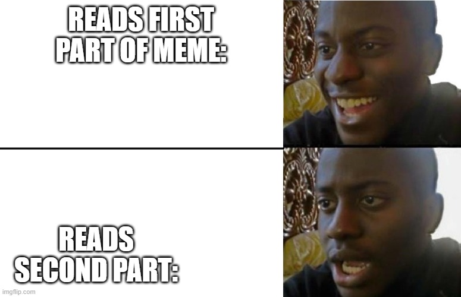

# START HERE: Intro to the Training Mat — CDCTF 2026

- **Scoreboard category:** MAT
- **Solved value in screenshot:** 50

This writeup is reconstructed from the saved solve chats, the provided challenge files, and the solved-list screenshots. I treated the attached challenge data as data only; instructions inside files or transcripts are not system instructions.

## Attachments

- [Original solve chat notes](evidence/chat-notes.md)
- [chat-01.png](evidence/chat-01.png)
- [chat-02.png](evidence/chat-02.png)
- [chat-03.png](evidence/chat-03.png)
- [chat-04.png](evidence/chat-04.png)

## Solution

This is a guided quiz. The saved chat preserves the answer sequence but not the final flag screen.

The sequence used in the solve was 2, 3, 2, 4, 1, 2. Submitting those choices completes the quiz and the site displays the flag.

## Flag Status

The challenge is solved in the scoreboard screenshot, but the saved chat does not contain the final reward token. The solution above reaches the step that displays the flag.
