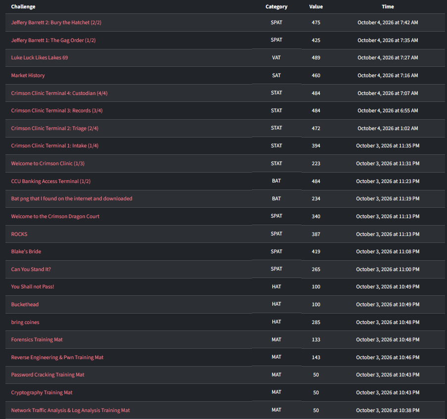
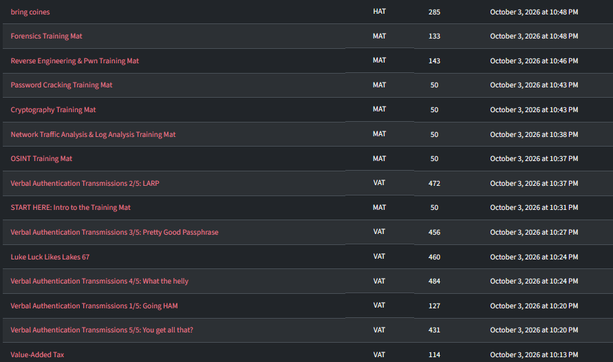

# CDCTF 2026 — Writeups

This collection covers the 32 solved challenges visible in the screenshots. Each challenge folder contains a human-readable English writeup, moved challenge attachments when the original data folder had files, and preserved evidence from the solve session.

## Challenges

### BAT

| Challenge | Points | Status |
|---|---:|---|
| [Bat png that I found on the internet and downloaded](BAT/Bat%20png%20that%20I%20found%20on%20the%20internet%20and%20downloaded/README.md) | 234 | flag recorded |
| [CCU Banking Access Terminal (1/2)](BAT/CCU%20Banking%20Access%20Terminal%20%281-2%29/README.md) | 484 | flag recorded |

### HAT

| Challenge | Points | Status |
|---|---:|---|
| [Buckethead](HAT/Buckethead/README.md) | 100 | flag recorded |
| [bring coines](HAT/bring%20coines/README.md) | 285 | flag recorded |
| [You Shall not Pass!](HAT/You%20Shall%20not%20Pass%21/README.md) | 100 | flag recorded |

### MAT

| Challenge | Points | Status |
|---|---:|---|
| [START HERE: Intro to the Training Mat](MAT/START%20HERE-%20Intro%20to%20the%20Training%20Mat/README.md) | 50 | solved; final step documented |
| [OSINT Training Mat](MAT/OSINT%20Training%20Mat/README.md) | 50 | flag recorded |
| [Network Traffic Analysis & Log Analysis Training Mat](MAT/Network%20Traffic%20Analysis%20%26%20Log%20Analysis%20Training%20Mat/README.md) | 50 | flag recorded |
| [Cryptography Training Mat](MAT/Cryptography%20Training%20Mat/README.md) | 50 | flag recorded |
| [Password Cracking Training Mat](MAT/Password%20Cracking%20Training%20Mat/README.md) | 50 | flag recorded |
| [Reverse Engineering & Pwn Training Mat](MAT/Reverse%20Engineering%20%26%20Pwn%20Training%20Mat/README.md) | 143 | flag recorded |
| [Forensics Training Mat](MAT/Forensics%20Training%20Mat/README.md) | 133 | flag recorded |

### SAT

| Challenge | Points | Status |
|---|---:|---|
| [Market History](SAT/Market%20History/README.md) | 460 | flag recorded |

### SPAT

| Challenge | Points | Status |
|---|---:|---|
| [ROCKS](SPAT/ROCKS/README.md) | 387 | flag recorded |
| [Blake's Bride](SPAT/Blake%27s%20Bride/README.md) | 419 | flag recorded |
| [Can You Stand It?](SPAT/Can%20You%20Stand%20It-/README.md) | 265 | flag recorded |
| [Welcome to the Crimson Dragon Court](SPAT/Welcome%20to%20the%20Crimson%20Dragon%20Court/README.md) | 340 | solved; final step documented |
| [Jeffery Barrett 1: The Gag Order (1/2)](SPAT/Jeffery%20Barrett%201-%20The%20Gag%20Order%20%281-2%29/README.md) | 425 | flag recorded |
| [Jeffery Barrett 2: Bury the Hatchet (2/2)](SPAT/Jeffery%20Barrett%202-%20Bury%20the%20Hatchet%20%282-2%29/README.md) | 475 | flag recorded |

### STAT

| Challenge | Points | Status |
|---|---:|---|
| [Welcome to Crimson Clinic (1/3)](STAT/Welcome%20to%20Crimson%20Clinic%20%281-3%29/README.md) | 223 | flag recorded |
| [Crimson Clinic Terminal 1: Intake (1/4)](STAT/Crimson%20Clinic%20Terminal%201-%20Intake%20%281-4%29/README.md) | 394 | solved; final step documented |
| [Crimson Clinic Terminal 2: Triage (2/4)](STAT/Crimson%20Clinic%20Terminal%202-%20Triage%20%282-4%29/README.md) | 472 | solved; final step documented |
| [Crimson Clinic Terminal 3: Records (3/4)](STAT/Crimson%20Clinic%20Terminal%203-%20Records%20%283-4%29/README.md) | 484 | flag recorded |
| [Crimson Clinic Terminal 4: Custodian (4/4)](STAT/Crimson%20Clinic%20Terminal%204-%20Custodian%20%284-4%29/README.md) | 484 | flag recorded |

### VAT

| Challenge | Points | Status |
|---|---:|---|
| [Value-Added Tax](VAT/Value-Added%20Tax/README.md) | 114 | flag recorded |
| [Luke Luck Likes Lakes 67](VAT/Luke%20Luck%20Likes%20Lakes%2067/README.md) | 460 | flag recorded |
| [Luke Luck Likes Lakes 69](VAT/Luke%20Luck%20Likes%20Lakes%2069/README.md) | 489 | flag recorded |
| [Verbal Authentication Transmissions 1/5: Going HAM](VAT/Verbal%20Authentication%20Transmissions%201-5-%20Going%20HAM/README.md) | 127 | flag recorded |
| [Verbal Authentication Transmissions 2/5: LARP](VAT/Verbal%20Authentication%20Transmissions%202-5-%20LARP/README.md) | 472 | solved; final step documented |
| [Verbal Authentication Transmissions 3/5: Pretty Good Passphrase](VAT/Verbal%20Authentication%20Transmissions%203-5-%20Pretty%20Good%20Passphrase/README.md) | 456 | flag recorded |
| [Verbal Authentication Transmissions 4/5: What the helly](VAT/Verbal%20Authentication%20Transmissions%204-5-%20What%20the%20helly/README.md) | 484 | flag recorded |
| [Verbal Authentication Transmissions 5/5: You get all that?](VAT/Verbal%20Authentication%20Transmissions%205-5%20-%20You%20get%20all%20that/README.md) | 421 | flag recorded |

## Notes

For Intake, Triage, Crimson Dragon Court, Intro Training Mat, and the final casing of LARP, the solved screenshot is available but the saved chat lacks the final accepted token. Those writeups describe the completed path and mark the flag as displayed after the last step.

Challenge files were moved from `D:/ctf/cdCTF` into each challenge's `attachments/` directory when a source file existed.
