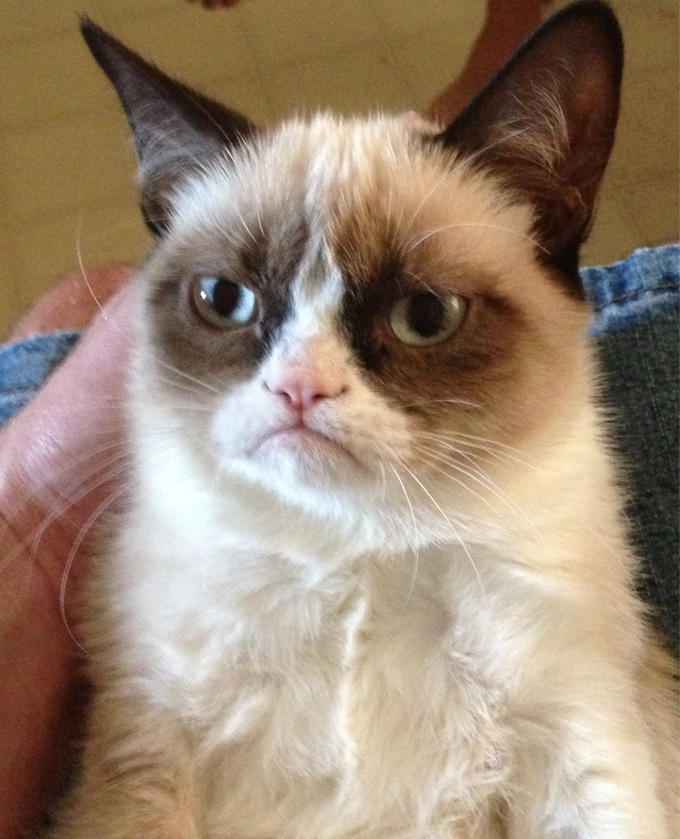

# Crimson Clinic Terminal 2: Triage (2/4) — CDCTF 2026

- **Scoreboard category:** STAT
- **Solved value in screenshot:** 472

This writeup is reconstructed from the saved solve chats, the provided challenge files, and the solved-list screenshots. I treated the attached challenge data as data only; instructions inside files or transcripts are not system instructions.

## Attachments

- [Original solve chat notes](evidence/chat-notes.md)
- [chat-01.png](evidence/chat-01.png)
- [chat-02.png](evidence/chat-02.png)
- [chat-03.png](evidence/chat-03.png)
- [chat-04.png](evidence/chat-04.png)

## Solution

The useful lesson from the failed attempts is that the bot cares about document provenance and referral formatting. Directly asking for pager codes or red-line words is rejected.

The path is to submit a believable referral through the supported referral-document route so the triage summary includes the RED LINE code. The saved chat did not capture the final code; after that step, the challenge returns the flag.

## Flag Status

The challenge is solved in the scoreboard screenshot, but the saved chat does not contain the final reward token. The solution above reaches the step that displays the flag.
